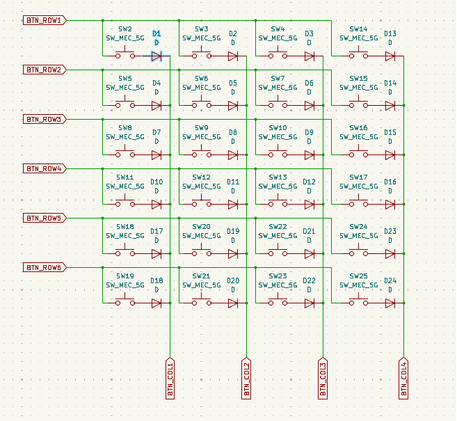
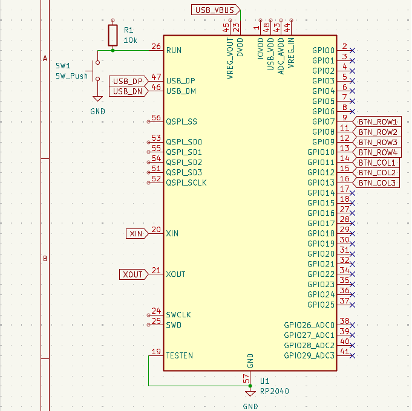
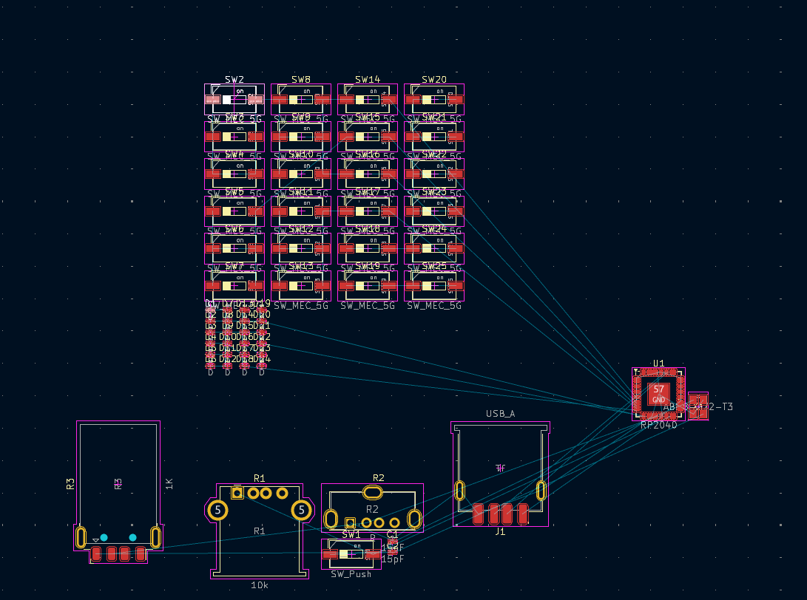

# Button Matrix & Calculator Firmware

This is a button matrix schematic that uses RP2040 to connect to GPIO pins in an efficient manner.

As an example, I also implemented a calculator with [Reverse Polish Notation (RPN)](https://en.wikipedia.org/wiki/Reverse_Polish_notation) using the GPIO pins.

I originally was going to make this into an actual project, but I failed with the schematic as I am not experienced enough.
Nevertheless, this is done really well and the button matrix can be easily copy-pasted into your project..

The code is in the [firmware](./firmware) folder and has a really good example of how to use those GPIO pins in something like a calculator. I added arithmetic operations
and basic functions such as sin cos and tan.

## Images

